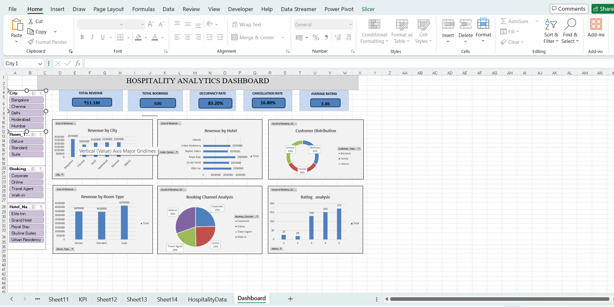
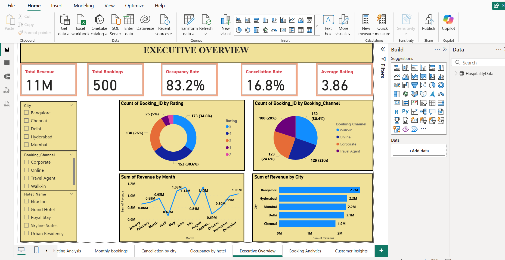
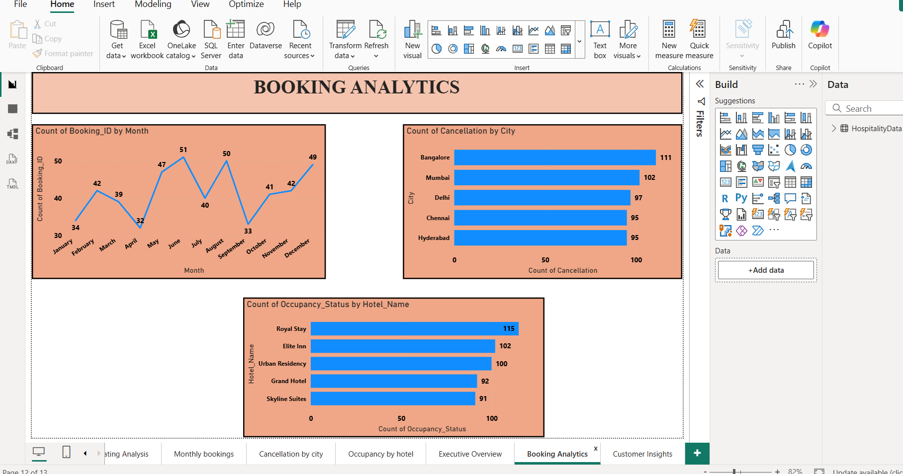
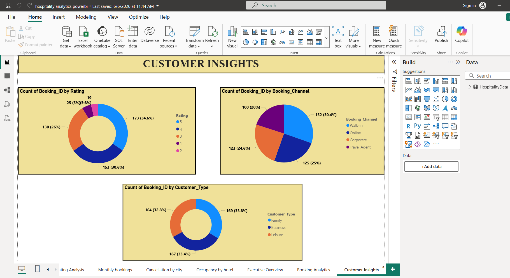
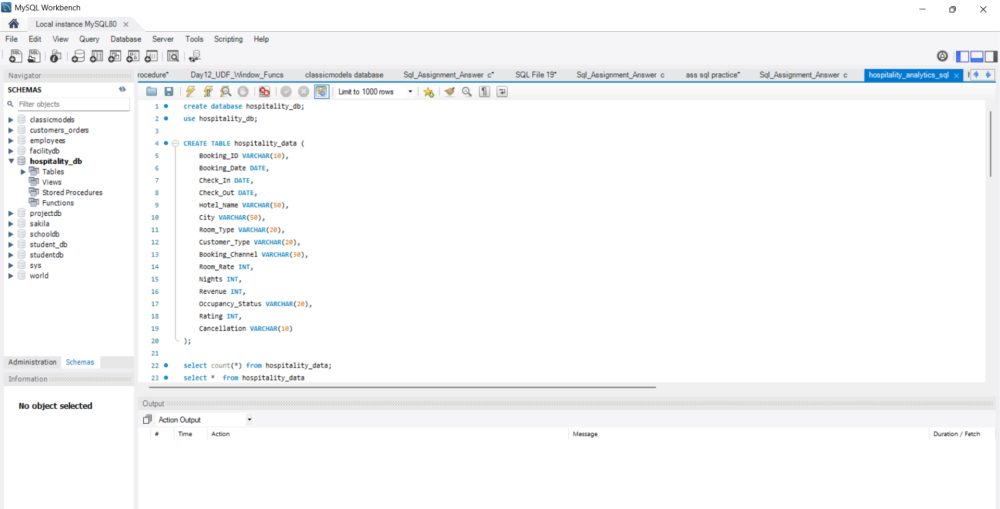
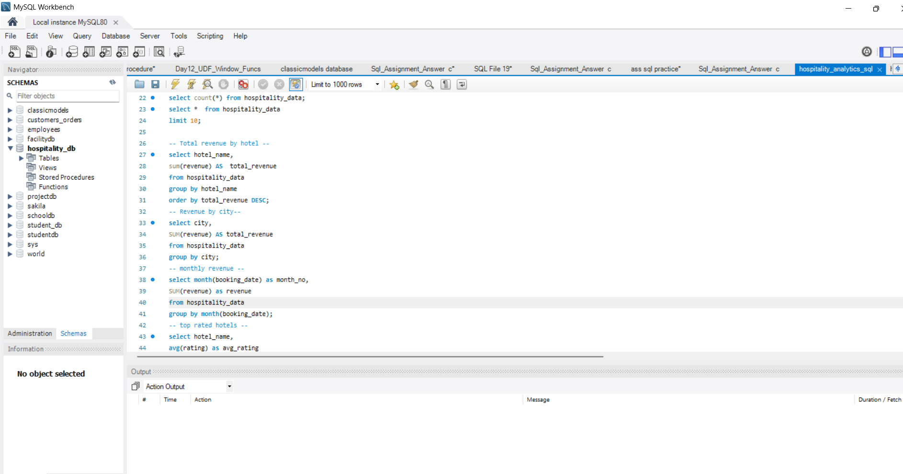
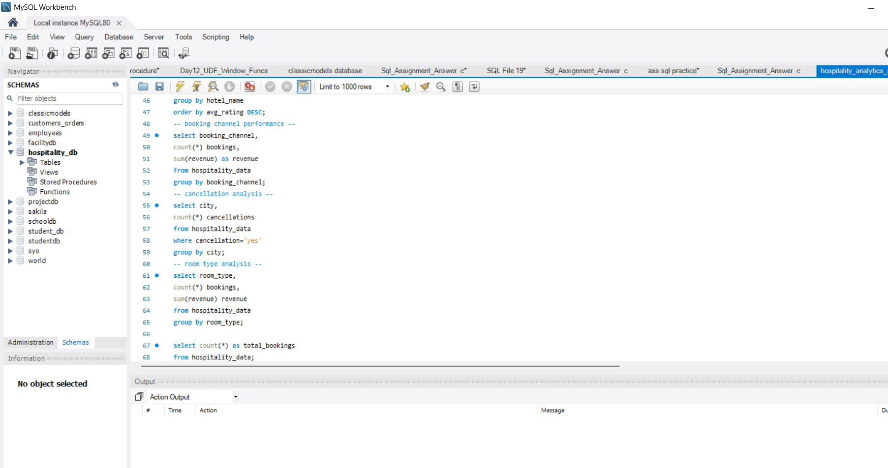
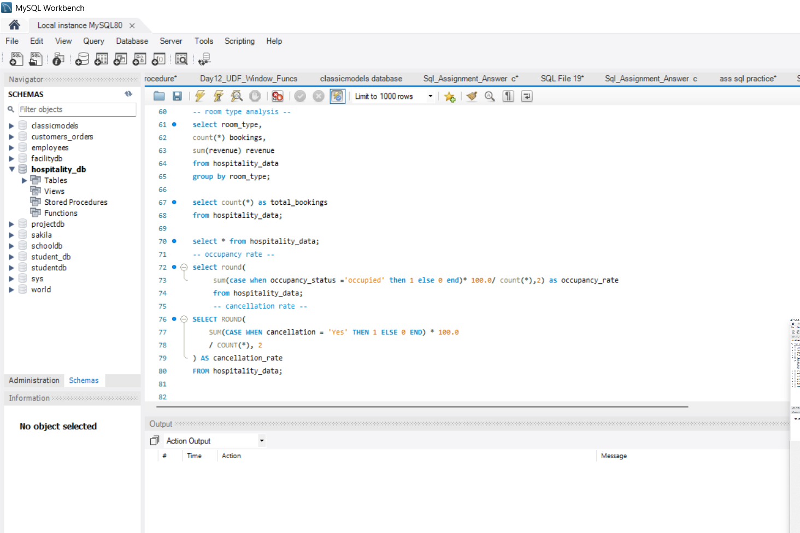

# Hospitality Analytics Project

## Project Overview

This project analyzes hotel booking and revenue data using SQL, Excel, and Power BI. The objective is to identify business insights related to revenue generation, occupancy performance, customer behavior, booking channels, room preferences, and hotel ratings.

## Dashboard Preview

### Excel Dashboard

### Power BI Dashboard

### SQL Analysis

## KPIs

- Total Revenue
- Total Bookings
- Occupancy Rate
- Cancellation Rate
- Average Rating

## Dashboard Features

- Revenue by City
- Revenue by Hotel
- Revenue by Room Type
- Monthly Revenue Trend
- Booking Channel Analysis
- Customer Distribution
- Rating Analysis

## Tools Used

- SQL
- Microsoft Excel
- Power BI

## Key Insights

- Identified top-performing hotels by revenue.
- Analyzed occupancy and cancellation trends.
- Compared revenue across cities and room types.
- Evaluated customer segments and booking channels.
- Monitored hotel ratings and customer satisfaction.

## Conclusion

This Hospitality Analytics Project provides valuable insights into hotel performance by analyzing booking, revenue, occupancy, cancellation, and customer behavior data.

Key findings include:
- Suite rooms generated the highest revenue among room types.
- Revenue varied significantly across different cities and hotels.
- Booking channels contributed differently to total bookings and revenue.
- Customer ratings helped evaluate service quality and guest satisfaction.
- Occupancy and cancellation rates highlighted operational performance and booking trends.

The dashboards created in Excel and Power BI enable stakeholders to monitor hotel performance, identify growth opportunities, and make data-driven business decisions.

---

## Project Files

📊 [Excel Dashboard](https://docs.google.com/spreadsheets/d/1zoF2IEciZ3NSf3egG571zyUJxMaWxx7z/edit?usp=drivesdk&ouid=116044505548148110088&rtpof=true&sd=true)

📈 [Power BI Dashboard](https://drive.google.com/file/d/1yRBAFghPjDMArhBSs2RMsz-_9lBi_J7Y/view?usp=drivesdk)

🗄️ [SQL Analysis File](https://drive.google.com/file/d/101wpjcMLDIu3uqFUtsnGVUmN1fQyyqQ6/view?usp=drivesdk)
